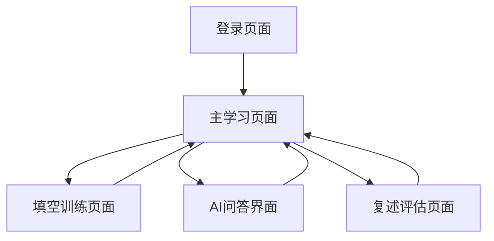

# 「记忆回响」讲解员个人记忆辅助工具 - 产品需求文档

## 1. 产品概述

「记忆回响」是一个智能、同步、个人专属的云端训练平台，利用AI技术帮助上海天文馆新晋讲解员将上万字的高精度科学讲稿高效地"刻"进大脑的肌肉记忆里。

产品通过云端同步、AI辅助训练和个性化评估，解决讲解员记忆大量专业内容的痛点，提供科学有效的记忆训练方法。目标是成为讲解员专业培训的核心工具，提升培训效率和质量。

## 2. 核心功能

### 2.1 用户角色

| 角色 | 注册方法 | 核心权限 |
|------|----------|----------|
| 讲解员 | 管理员后台分配账户 | 登录系统、使用所有训练功能、查看个人进度 |
| 管理员 | Supabase后台管理 | 创建用户账户、管理内容数据、查看用户进度 |

### 2.2 功能模块

产品包含以下核心页面：

1. **登录页面**：用户身份验证，使用管理员分配的邮箱密码登录
2. **主学习页面**：内容展示、导航面板、训练模式切换
3. **填空训练页面**：交互式填空练习，实时反馈正确性
4. **AI问答界面**：智能问答助手，解答学习疑问
5. **复述评估页面**：语音复述训练，AI智能评估

### 2.3 页面详情

| 页面名称 | 模块名称 | 功能描述 |
|----------|----------|----------|
| 登录页面 | 身份验证 | 邮箱密码登录，会话保持，错误提示 |
| 主学习页面 | 导航面板 | 展示讲稿章节结构，支持快速跳转，显示学习进度 |
| 主学习页面 | 内容展示区 | 显示当前段落标题和正文，提供操作按钮 |
| 主学习页面 | 操作栏 | 切换训练模式，访问AI功能 |
| 填空训练页面 | 填空练习 | 生成填空题，实时验证答案，显示正确答案 |
| AI问答界面 | 智能问答 | 输入问题，调用AI API，展示回答结果 |
| 复述评估页面 | 语音录制 | 录制用户复述，语音转文字 |
| 复述评估页面 | AI评估 | 分析复述内容，生成评估报告，记录学习数据 |

## 3. 核心流程

### 用户操作流程

用户首先在登录页面输入管理员分配的邮箱和密码进行身份验证。登录成功后进入主学习页面，可以通过左侧导航面板选择不同的讲稿段落。在内容展示区查看当前段落的标题和正文内容。

用户可以点击"开始填空训练"进入填空模式，系统会将正文中的关键词替换为输入框，用户填写后实时显示正确性。也可以点击"AI小老师"按钮，输入与当前段落相关的问题获得AI解答。

在复述训练模式下，用户通过语音输入对当前段落进行复述，系统将语音转换为文字后发送给AI进行评估，返回包含评分、优点和改进建议的详细报告。

## 4. 用户界面设计

### 4.1 设计风格

- **主色调**：深蓝色背景(#003049)营造专注学习氛围
- **文字颜色**：香草色(#EAE2B7)提供清晰阅读体验
- **强调色**：橙色(#F77F00)用于按钮和交互元素
- **按钮样式**：透明背景，橙色边框，圆角设计，悬浮效果
- **字体**：思源黑体，基础字号16px
- **布局风格**：左右分栏布局，左侧导航面板占25%-30%宽度
- **图标风格**：简洁线性图标，与整体风格协调

### 4.2 页面设计概览

| 页面名称 | 模块名称 | UI元素 |
|----------|----------|--------|
| 登录页面 | 登录表单 | 居中卡片布局，深蓝背景，橙色登录按钮，输入框焦点橙色边框 |
| 主学习页面 | 导航面板 | 深蓝背景，树形结构，选中项橙色高亮，左侧橙色边框指示 |
| 主学习页面 | 内容区域 | 香草色文字，清晰标题层级，底部橙色操作按钮 |
| 填空训练页面 | 填空输入框 | 透明背景，香草色边框，正确时橙色边框，错误时红色边框 |
| AI问答界面 | 对话界面 | 问题输入框，AI回答区域，发送按钮橙色强调 |
| 复述评估页面 | 录音控件 | 录音按钮，波形显示，评估结果卡片布局 |

### 4.3 响应式设计

产品采用桌面优先设计，针对讲解员的学习场景优化。在平板设备上导航面板可折叠，在手机端采用底部导航栏替代侧边栏。所有交互元素支持触摸操作，确保在不同设备上的良好体验。