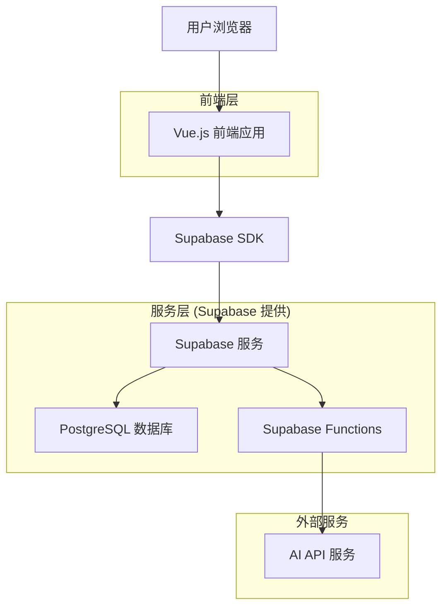
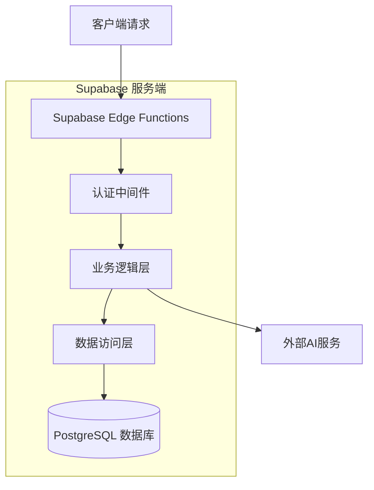
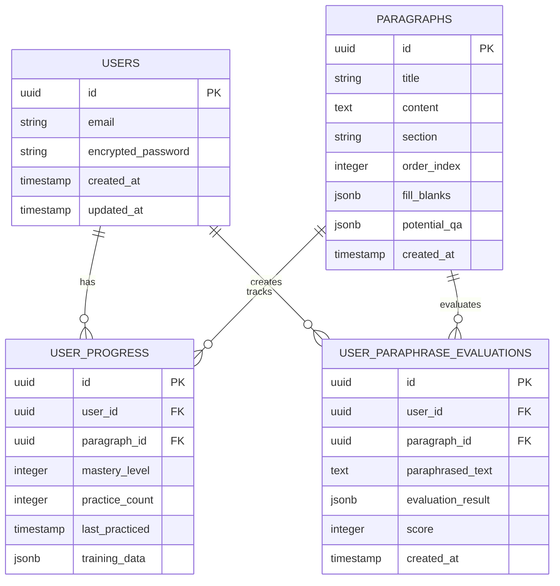

# 「记忆回响」讲解员个人记忆辅助工具 - 技术架构文档

## 1. 架构设计



## 2. 技术描述

- **前端**: Vue.js@3 + Vite + Pinia + TailwindCSS
- **后端**: Supabase (BaaS)
- **数据库**: Supabase (PostgreSQL)
- **AI服务**: 通过Supabase Functions调用外部AI API

## 3. 路由定义

| 路由 | 用途 |
|------|------|
| /login | 登录页面，用户身份验证 |
| / | 主学习页面，内容展示和导航 |
| /training/:id | 填空训练页面，交互式练习 |
| /ai-chat/:id | AI问答界面，智能助手对话 |
| /paraphrase/:id | 复述评估页面，语音训练和评估 |

## 4. API定义

### 4.1 核心API

**用户认证相关**
```
POST /auth/v1/token
```

请求参数:
| 参数名 | 参数类型 | 是否必需 | 描述 |
|--------|----------|----------|------|
| email | string | true | 用户邮箱 |
| password | string | true | 用户密码 |
| grant_type | string | true | 固定值 "password" |

响应:
| 参数名 | 参数类型 | 描述 |
|--------|----------|------|
| access_token | string | JWT访问令牌 |
| refresh_token | string | 刷新令牌 |
| user | object | 用户信息对象 |

**AI问答功能**
```
POST /functions/v1/ai-tutor
```

请求参数:
| 参数名 | 参数类型 | 是否必需 | 描述 |
|--------|----------|----------|------|
| query | string | true | 用户问题 |
| context | string | true | 当前段落内容 |
| paragraph_id | string | true | 段落ID |

响应:
| 参数名 | 参数类型 | 描述 |
|--------|----------|------|
| answer | string | AI回答内容 |
| status | string | 请求状态 |

**复述评估功能**
```
POST /functions/v1/paraphrase-evaluator
```

请求参数:
| 参数名 | 参数类型 | 是否必需 | 描述 |
|--------|----------|----------|------|
| original_text | string | true | 原始段落文本 |
| paraphrased_text | string | true | 用户复述文本 |
| paragraph_id | string | true | 段落ID |

响应:
| 参数名 | 参数类型 | 描述 |
|--------|----------|------|
| evaluation | object | 评估结果对象 |
| score | number | 评估分数 (0-100) |
| strengths | array | 优点列表 |
| improvements | array | 改进建议列表 |

示例响应:
```json
{
  "evaluation": {
    "score": 85,
    "strengths": ["准确描述了地球的基本特征", "使用了恰当的科学术语"],
    "improvements": ["可以补充更多关于地球大气层的描述"],
    "overall_feedback": "整体复述质量良好，建议加强细节描述"
  },
  "score": 85
}
```

## 5. 服务器架构图



## 6. 数据模型

### 6.1 数据模型定义



### 6.2 数据定义语言

**用户表 (auth.users)**
```sql
-- Supabase自动管理用户表，无需手动创建
-- 管理员通过Supabase Dashboard创建用户
```

**段落内容表 (paragraphs)**
```sql
CREATE TABLE paragraphs (
    id UUID PRIMARY KEY DEFAULT gen_random_uuid(),
    title VARCHAR(255) NOT NULL,
    content TEXT NOT NULL,
    section VARCHAR(100) NOT NULL,
    order_index INTEGER NOT NULL,
    fill_blanks JSONB DEFAULT '[]'::jsonb,
    potential_qa JSONB DEFAULT '[]'::jsonb,
    created_at TIMESTAMP WITH TIME ZONE DEFAULT NOW()
);

-- 创建索引
CREATE INDEX idx_paragraphs_section ON paragraphs(section);
CREATE INDEX idx_paragraphs_order ON paragraphs(order_index);

-- 启用RLS
ALTER TABLE paragraphs ENABLE ROW LEVEL SECURITY;

-- 设置访问策略
CREATE POLICY "Allow read access to all users" ON paragraphs
    FOR SELECT TO authenticated USING (true);

CREATE POLICY "Allow read access to anonymous users" ON paragraphs
    FOR SELECT TO anon USING (true);
```

**用户进度表 (user_progress)**
```sql
CREATE TABLE user_progress (
    id UUID PRIMARY KEY DEFAULT gen_random_uuid(),
    user_id UUID REFERENCES auth.users(id) ON DELETE CASCADE,
    paragraph_id UUID REFERENCES paragraphs(id) ON DELETE CASCADE,
    mastery_level INTEGER DEFAULT 0 CHECK (mastery_level >= 0 AND mastery_level <= 100),
    practice_count INTEGER DEFAULT 0,
    last_practiced TIMESTAMP WITH TIME ZONE DEFAULT NOW(),
    training_data JSONB DEFAULT '{}'::jsonb,
    created_at TIMESTAMP WITH TIME ZONE DEFAULT NOW(),
    updated_at TIMESTAMP WITH TIME ZONE DEFAULT NOW()
);

-- 创建索引
CREATE INDEX idx_user_progress_user_id ON user_progress(user_id);
CREATE INDEX idx_user_progress_paragraph_id ON user_progress(paragraph_id);
CREATE UNIQUE INDEX idx_user_progress_unique ON user_progress(user_id, paragraph_id);

-- 启用RLS
ALTER TABLE user_progress ENABLE ROW LEVEL SECURITY;

-- 设置访问策略
CREATE POLICY "Users can view own progress" ON user_progress
    FOR SELECT TO authenticated USING (auth.uid() = user_id);

CREATE POLICY "Users can insert own progress" ON user_progress
    FOR INSERT TO authenticated WITH CHECK (auth.uid() = user_id);

CREATE POLICY "Users can update own progress" ON user_progress
    FOR UPDATE TO authenticated USING (auth.uid() = user_id);
```

**用户复述评估表 (user_paraphrase_evaluations)**
```sql
CREATE TABLE user_paraphrase_evaluations (
    id UUID PRIMARY KEY DEFAULT gen_random_uuid(),
    user_id UUID REFERENCES auth.users(id) ON DELETE CASCADE,
    paragraph_id UUID REFERENCES paragraphs(id) ON DELETE CASCADE,
    paraphrased_text TEXT NOT NULL,
    evaluation_result JSONB NOT NULL,
    score INTEGER CHECK (score >= 0 AND score <= 100),
    created_at TIMESTAMP WITH TIME ZONE DEFAULT NOW()
);

-- 创建索引
CREATE INDEX idx_paraphrase_evaluations_user_id ON user_paraphrase_evaluations(user_id);
CREATE INDEX idx_paraphrase_evaluations_paragraph_id ON user_paraphrase_evaluations(paragraph_id);
CREATE INDEX idx_paraphrase_evaluations_created_at ON user_paraphrase_evaluations(created_at DESC);
CREATE INDEX idx_paraphrase_evaluations_score ON user_paraphrase_evaluations(score DESC);

-- 启用RLS
ALTER TABLE user_paraphrase_evaluations ENABLE ROW LEVEL SECURITY;

-- 设置访问策略
CREATE POLICY "Users can view own evaluations" ON user_paraphrase_evaluations
    FOR SELECT TO authenticated USING (auth.uid() = user_id);

CREATE POLICY "Users can insert own evaluations" ON user_paraphrase_evaluations
    FOR INSERT TO authenticated WITH CHECK (auth.uid() = user_id);

-- 初始化示例数据
INSERT INTO paragraphs (title, content, section, order_index, fill_blanks) VALUES
('地球 - 我们的家园', '我们的家园地球，是太阳系中一颗充满生机的蓝色星球。它的直径约为12742公里，是距离太阳第三近的行星。', '家园展区', 1, 
'[{"text": "我们的家园地球，是太阳系中一颗充满", "blank": "生机", "options": ["生机", "活力", "生命"]}, {"text": "的蓝色星球。它的直径约为", "blank": "12742", "options": ["12742", "12756", "12734"]}]');
```